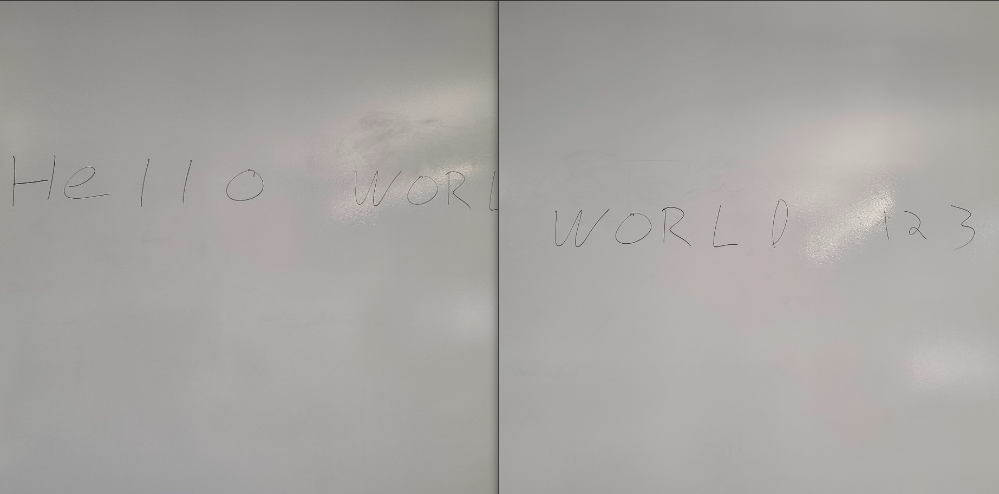
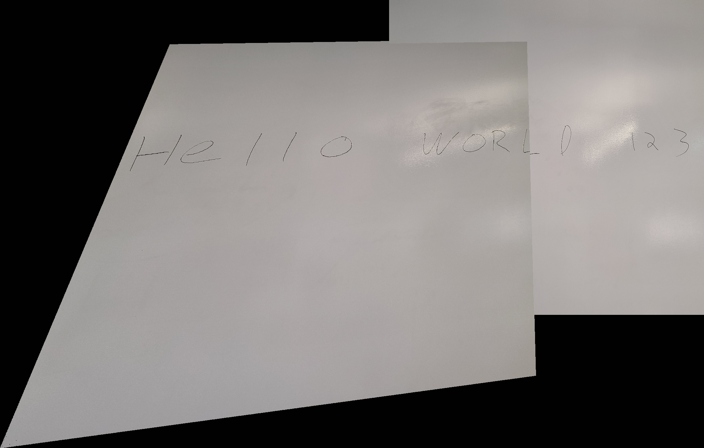
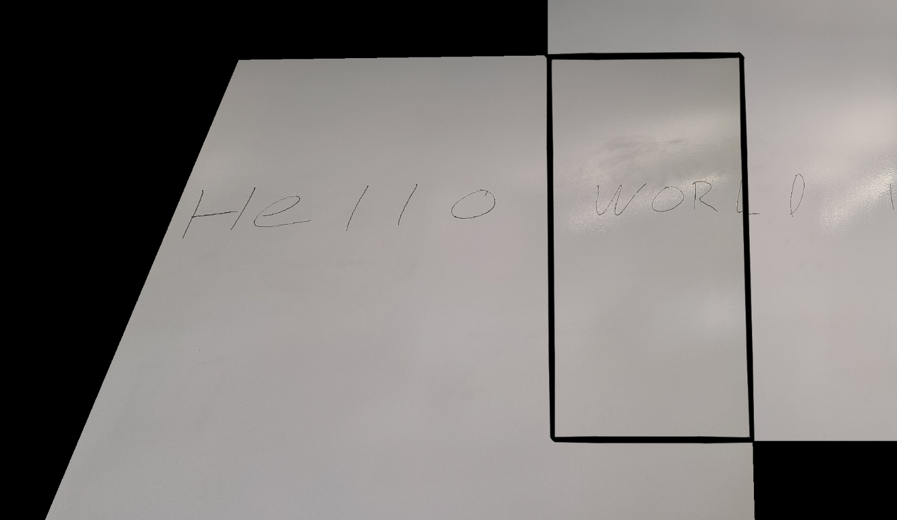
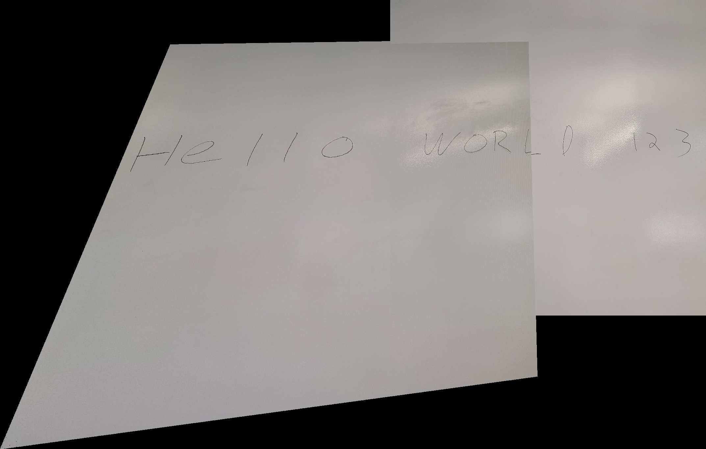
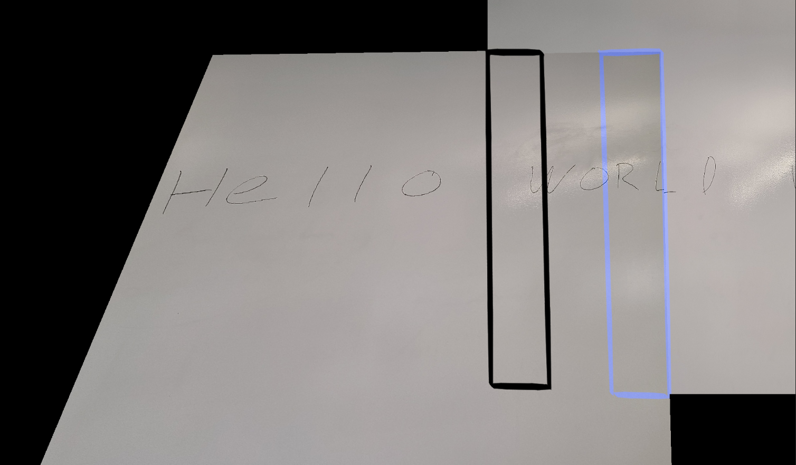

------
# Project 3: Image Mosaics

## Team Members
- Jonathan Lee
- Graham Schock
- Jack Umina

## Overview
Image mosaics are created by compositing multiple images together by computing the perspective transformation between images. 
We captured our own photographs and implemented a GUI so that users could select features to map between images. 
We also implemented three bells and whistles. 
The code is available at [github.com/jonlee48/image-mosaics](https://github.com/jonlee48/image-mosaics)

### Sections
1. [Shoot and choose good pictures](#1---shoot-and-choose-good-pictures)
2. [Recover homographies](#2---recover-homographies)
   1. [Bell and whistle - implemented perspective warping using our own math](#21---bell-and-whistle---implemented-perspective-warping-using-our-own-math)
3. [Warp the images](#3---warp-the-images)
4. [Blend images into a mosaic](#4---blend-images-into-a-mosaic)
5. [Additional bells and whistles](#5---additional-bells-and-whistles)
   1. [Image blending](#52---image-blending)
   2. [Augmented reality](#53---augmented-reality)

## 1 - Shoot and choose good pictures
We selected a photo of a car on the highway and a stock image of a license plate. We could do some interesting things, 
such as warping the photo of the car to make the license plate easier to read, or map the photo of the license plate onto the car's license plate.



We chose the following photos because they were visually appealing - landscape scenes with lots of points of interest. 
Additionally, each set of images had unique features which made it easier to find 4 corresponding points in the photos.
For example, the corners of the windows of the ski lodge would make good points to solve for a homography. 








## 2 - Recover homographies

The points used to calculate the homography are selected by clicking points 4 points on each image in a GUI. 
As the user clicks, a colored dot is drawn to show where the user clicked.
Then the homography to map one set of points to the other is computed and the result is displayed.



The challenge of hand selecting points on the GUI ends up being the image dimensions. 
The coordinates selected on the screen don't necessarily correspond to the same pixel coordinates if the image is not displayed 1:1.
To avoid this issue of scaling, we simply resize the image to a manageable size so that it will always fit on a 1080p screen.
The downside to this approach is we end up with a lower resolution result, but it makes the transformation calculation faster.


### 2.1 - Bell and Whistle - implemented perspective warping using our own math
We chose to compute the homography ourselves for this project rather than use any Python libraries. The general idea is to solve the following equation:

$$
Ah = 0
$$

Let us first define a point correspondence. A point correspondence is a pair of coordinates (x,y) and (x', y') that represent the matching two locations in image one and two.

$h$ is the homography and is a 1x9 matrix that will later be shaped into a 3x3 matrix, and $A$ is a 2n x 9 matrix where n is the number of point correspondences between the two images.

For each point correspondence between a pair of images, the following two rows are appended to matrix $A$:

$$
[-x, -y, -1,    0,    0,  0, x*x', y*x', x'] \\
[   0,    0,  0, -x, -y, -1, x*y', y*y', y']
$$

We then use single value decomposition to solve $Ah=0$ for $h$. 

$$
A = U \Sigma V^T
$$

The last column of $V$ contains the vectorized entries of $H$. We simply reshape the column vector into a 3x3 matrix to get $H$.

Here is our implementation in python.
```python
def computeH(im1_pts, im2_pts):
    '''
        Computes and returns the homography between two images.

        im1_pts and im2_pts are n-by-2 matrices holding the 
        (x,y) locations of n point correspondences from the two images
        
        Returns H, the recovered 3x3 homography matrix
    '''
    A = [] 

    assert(len(im1_pts) == len(im2_pts))

    for im1, im2 in zip(im1_pts,im2_pts):
        x = im1[0]
        y = im1[1]

        xp = im2[0]
        yp = im2[1]

        A.append(np.array([-1*x, -1*y, -1,    0,    0,  0, x*xp, y*xp, xp]))
        A.append(np.array([   0,    0,  0, -1*x, -1*y, -1, x*yp, y*yp, yp]))

    A = np.array(A)

    # use single value decomposition to solve for H
    u, s, v = np.linalg.svd(A)

    # H is last column of v
    H = v[8].reshape((3,3))
    # normalize H
    H = (1 / H.item(8)) * H

    return H
```

## 3 - Warp the images
The image warping is computed by multiplying the homography $H$ against every pixel coordinate in the image to find its transformed location.
```python
for w in range(im1.shape[1]):
    for h in range(im1.shape[0]):
        p = (w,h,1)
        pp = H @ p
        # normalize by 3rd coordinate
        pp = pp / pp[2]
        wp, hp, _ = pp
        wp = round(wp+origin_w) # use round() instead of int()
        hp = round(hp+origin_h)
        # set the patch of n pixels around mapped coordinates to the pixel color (to account for rounding error)
        n = 1 # increase this number if patches in the image appear blank
        mosaic[hp:hp+n+1,wp:wp+n+1,:] = im1[h,w,:]
```


In the result we can see that the numbers from the license plate are warped to appear as if the perspective was straight on.
This demonstrates that our approach is working. One practical use case for text rectification is optical character recognition (OCR) where the text is first 
aligned to make it easier to read.

One issue we had to overcome is missing pixels when the transformed image is stretched. Stretching an image means
we need to fill in space in areas where no pixels have been mapped onto. 
We account for this by filling in a patch of pixels to cover up empty pixels. This approach works very well, however the 
size of the image patch needs to be adjusted depending on how severe the warping is.

## 4 - Blend images into a mosaic
These are the mosaics of the images from above. These results are without any blending algorithms applied.
The warped image simply overwrites the pixel values from the other image.





## 5 - Additional bells and whistles

### 5.1 - Image blending

In order to demonstrate the blending process the best we wanted to have images that had similar features but differnet levels of contrast. 

We decided to use a whiteboard with writing as the light can reflect off of interesting angles to create differnet contrasts.



Our naive approach to blend these two images is just to write the first image over the second one. 



In this photo, we clearly see the lines where the two images are. 

Next, we tried to identify the overlap of the two images for example: 



In pseudocode this would be: 

``` sh
while writing second image pixel: 
    if (pixels are already present)
        overlap[pixel] = true
```

Once we know where the overlap is we tried to just take 50% from each image in this region, again in pseudocode: 

``` sh
while writing second image pixel: 
    if (pixels are already present)
        newpixel = (0.5 * curpixel) + (0.5 * oldpixel)
```

This would give us the result: 



In this mosaic, we can still see an edge, but there is more of a gradual difference between the two images.

Finally, as we move across the overlap region the values that we are trying to approximate change. 



For example, in this image we would want the region in black to repersent more of the left image and the region in blue to repersent more of the right image. Because of this we can change the weight of each image as we move across the border region, again in pseudocode:

``` sh
while writing second image pixel: 
    if (pixels are already present)
        w = (current_width / total_width)
        newpixel = (w * curpixel) + ((1-w) * oldpixel)
```

This would give us the result: 


As we can see this result is a lot better and the transition feels smooth.


### 5.2 - Augmented Reality

The goal for this feature was to simulate the idea of having a painting on a wall. 



We started with the video above, a video of a wall. On the wall was a sheet of paper that had a checkerboard printed on it. Using an OpenCV function, we were able to automatically find the 4 corners of the checkerboard so that they could be used in computing the homography between an individual frame of the video and an image of a paitning. We used Van Gogh's iconic Starry Night as the painting.

A high-level psuedocode algorithm for this feature is as follows:
```
for each frame in the video:
    1. use OpenCV to get the 4 corners of the checkerboard on the wall
    2. compute the homography between the frame and starry night 
    3. using the homography matrix, transform Starry Night to cover checkerboard

compress frames back into video
```

This produced the following result:


